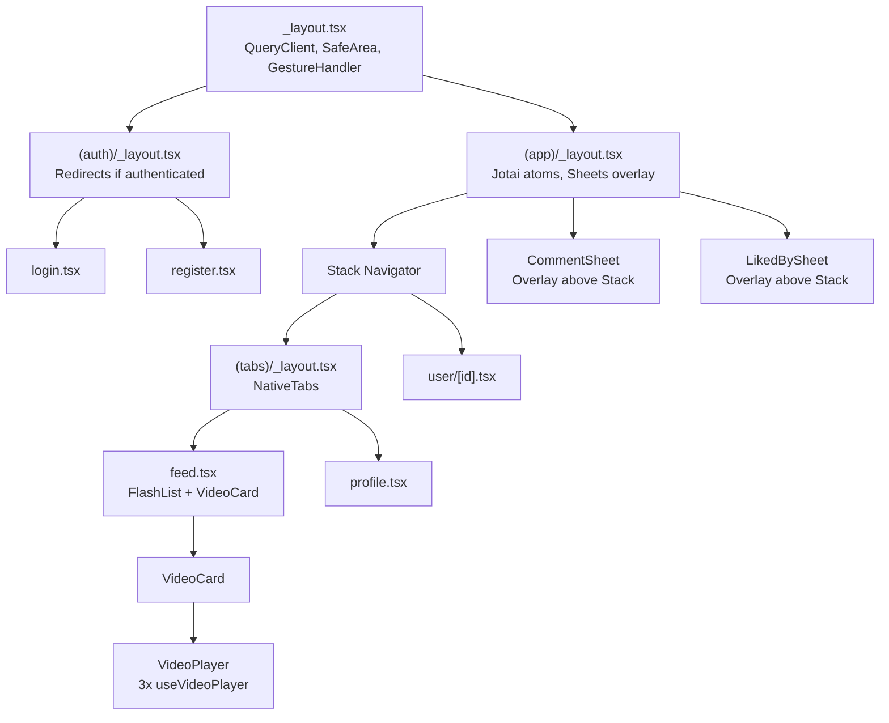
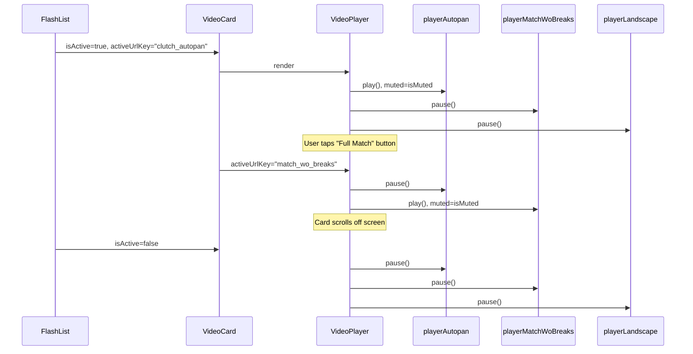
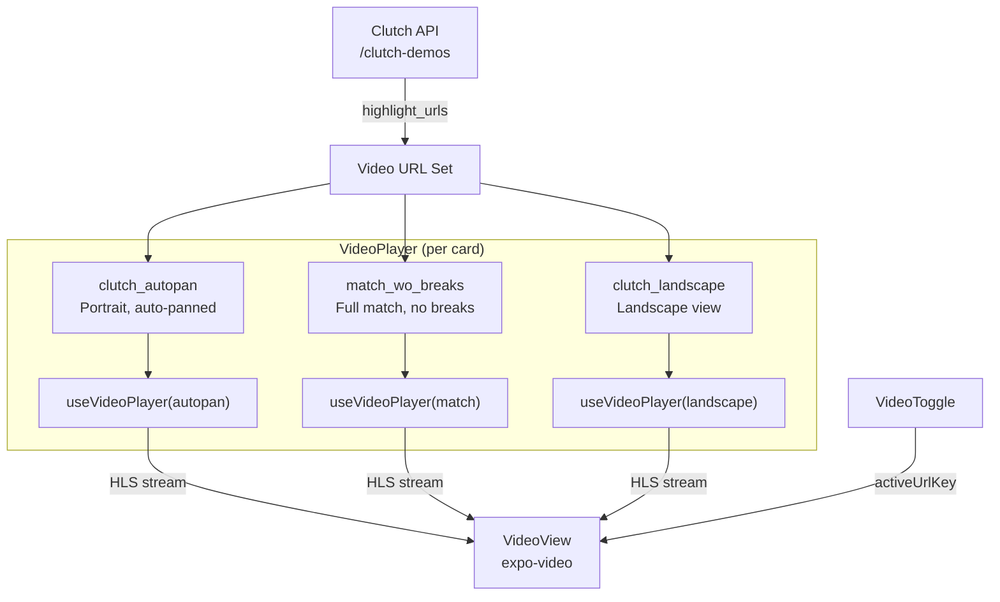
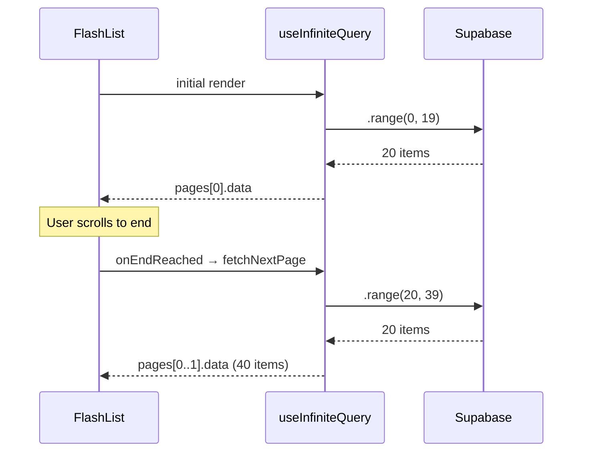
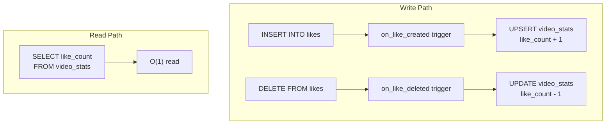
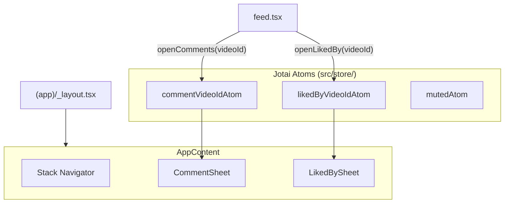

# Architecture

## App Structure

## Video Player Architecture

Each `VideoCard` renders a `VideoPlayer` with three `useVideoPlayer` instances — one per video URL type (autopan, match without breaks, landscape). Only the active URL key's player plays; the other two are paused.

A thumbnail overlay (using `expo-image`) covers the video until the native compositor renders the first frame. The thumbnail hides 300ms after `readyToPlay` status to avoid flash.

## HLS Video Delivery

The Clutch API returns highlight URLs containing HLS (HTTP Live Streaming) video streams. Each highlight has three video variants and corresponding thumbnails.

Only the active player plays at any time — the other two are paused. A thumbnail overlay covers the video until the native compositor renders the first frame (300ms delay after `readyToPlay` + 150ms fade).

## Pagination Strategy

Infinite scroll uses TanStack Query's `useInfiniteQuery` with Supabase `.range()` for cursor-based pagination.

Each page returns `{ data, nextCursor }`. The `getNextPageParam` extracts the cursor. Pages are flattened with `data.pages.flatMap(p => p.data)`.

## Denormalized Counters

Instead of `COUNT(*)` queries (O(n)), a `video_stats` table stores pre-computed `like_count` and `comment_count`. PostgreSQL triggers maintain these automatically.

The client never writes to `video_stats` directly — RLS makes it read-only. Optimistic updates on the client side are reconciled when the query refetches.

## Bottom Sheet State (Jotai Atoms)

Comment and liked-by sheets are rendered as overlays in `(app)/_layout.tsx`, above the Stack navigator. Jotai atoms in `src/store/` manage open/close state — no providers needed.

This pattern ensures sheets persist across screen transitions within the app stack. The sheets use `@gorhom/bottom-sheet` with `snapPoints` (50%/90%) and `footerComponent` for a sticky input that stays above the keyboard.
